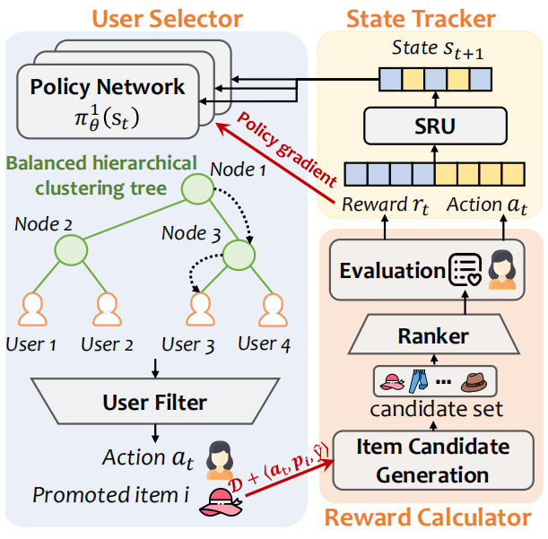
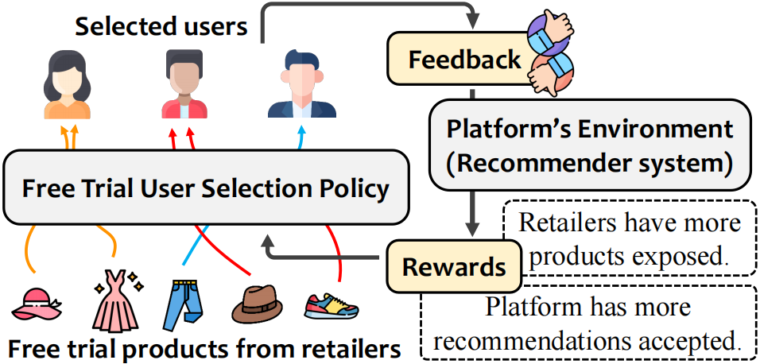

# Who Are the Best Adopters? User Selection Model for Free Trial Item Promotion (SMILE)
[](https://www.python.org/)
[](https://pytorch.org/)

This repository contains the official Pytorch implementation for the paper *Who Are the Best Adopters? User Selection Model for Free Trial Item Promotion*. 





More descriptions are available via the [paper](https://ieeexplore.ieee.org/document/9882319) 

If this work helps you, please kindly cite our papers:

```latex
@ARTICLE{wang2022smile, 
author={Wang, Shiqi and Gao, Chongming and Gao, Min and Yu, Junliang and Wang, Zongwei and Yin, Hongzhi},  
journal={IEEE Transactions on Big Data},  
title={Who are the Best Adopters? User Selection Model for Free Trial Item Promotion},   year={2022},  volume={},  number={},  pages={1-12},  doi={10.1109/TBDATA.2022.3205334}}
```

## Main Contributors

<table border="0">
  <tbody>
    <tr align="center" >
      <td>
        ​ <a href="https://github.com/Strawberry47"></a><br>
        ​ <a href="https://github.com/Strawberry47">Shiqi Wang</a> ​
        <p>Chongqing University <br> (重庆大学)  </p>​
      </td>
      <td>
         <a href="https://github.com/chongminggao"></a><br>
         <a href="https://github.com/chongminggao">Chongming Gao</a> ​
        <p>USTC <br> (中科大) </p>​
      </td>
    </tr>
  </tbody>
</table>
